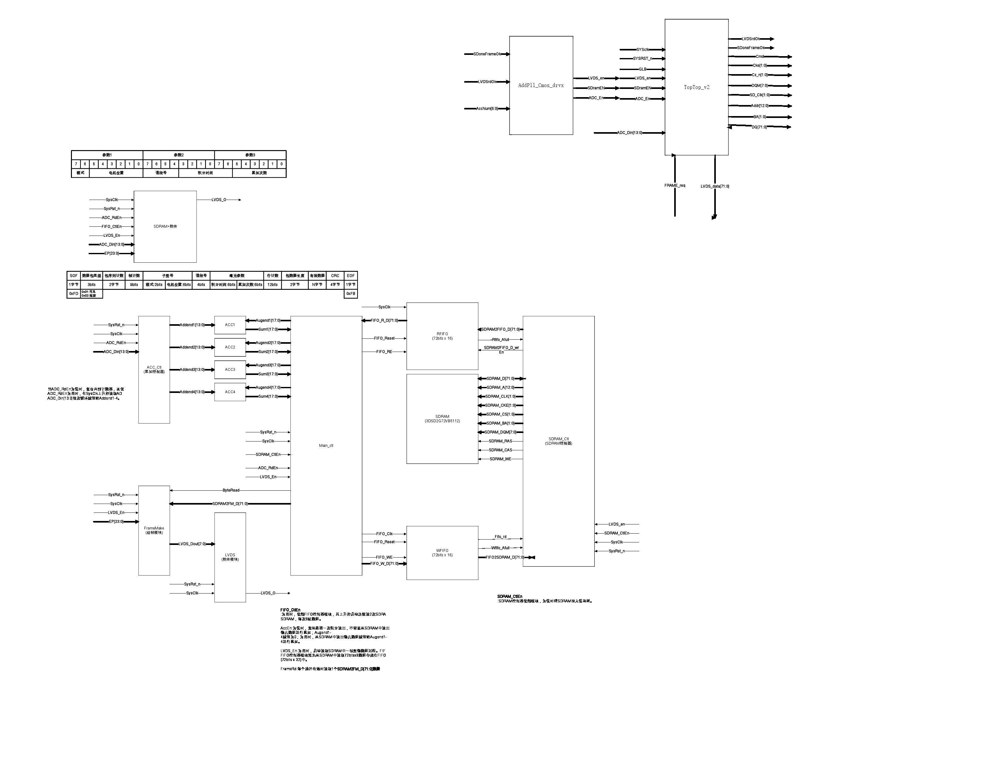

# Image Sensor System
A project of CMOS image sensor system. The doc mainly includes LUPA4000 CMOS sensor driving, SDRAM storage, LVDS data readout etc. The code is written in VHDL.

To make this project helpful for you, you should employ Actel FPGA and their IDE. Because some modules are dependent on actel's IP, please read the project workflow visio for interfaces of modules.

# Project Architecture

